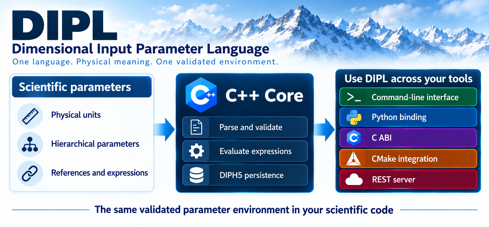

# Scientific Numerical Tools v3 `{?SNT3}`

Unit-safe, strongly typed, validated input parameters for scientific and
engineering software.

Focus on your science. Leave the parameter plumbing to SciNumTools.

[](https://github.com/scinumtools/snt3/actions/workflows/c-cpp-build.yml)
[](https://codecov.io/github/scinumtools/snt3)
[](https://github.com/scinumtools/snt3/releases)
[](https://pypi.org/project/scinumtools3/)
[](https://anaconda.org/conda-forge/scinumtools3)
[](https://vcpkg.io/en/package/scinumtools3.html)
[](https://github.com/scinumtools/homebrew-tap/blob/main/Formula/scinumtools3.rb)
[](LICENSE)


[](https://scinumtools.github.io/snt3/)
[](https://scinumtools.github.io/snt3/initiative.html)

SciNumTools provides a common representation for physical quantities and
validated scientific input parameters. Its C++17 libraries can be used from
C/C++, Python, the command line, and CMake.

The project is built around two languages:

- **PUEL** describes values, units, uncertainties, arrays, and unit systems.
  See the [PUEL language specification](https://scinumtools.github.io/snt3/puel/index.html).
- **DIPL** describes typed input parameters, constraints, and relationships.
  See the [DIPL language specification](https://scinumtools.github.io/snt3/dipl/index.html).

DIPL can serve as the single source of validated truth for a scientific
model: values, units, constraints, derived relationships, and provenance stay
together in one portable definition rather than being distributed across
configuration files and application code.

The [online documentation](https://scinumtools.github.io/snt3/) contains
the concepts, language specifications, tutorials, examples, and API reference.



## Why DIPL?

Scientific software often begins with a small configuration file, then grows
into values spread across input files, unit conversions, validation code,
derived constants, and undocumented assumptions. That makes a model harder to
review, reproduce, and safely reuse in another tool or language.

DIPL was created to make the parameter definition itself the authoritative
model interface. It keeps physical units, types, constraints, hierarchical
structure, references, expressions, metadata, and provenance together, then
exposes one evaluated and validated environment to every part of an
application. The result is less duplicated glue code and a clearer boundary
between a scientific model's assumptions and its implementation.

## AI-assisted scientific setup

AI assistants, including large language models (LLMs), can draft scientific
setups, but those drafts need explicit checks. DIPL gives them a readable,
structured description of run settings and references to initial-condition
files. SciNumTools checks declared types, units, constraints, and dependencies;
a code-specific adapter can check further requirements and write the code's
native input files. This makes an AI-assisted setup easier to inspect and test
before a run. Scientific review is still needed to judge whether the choices
are physically appropriate.

## One parameter layer for many scientific codes

<a href="https://scinumtools.github.io/snt3/initiative.html"></a>

We are inviting maintainers of established, open-source scientific codes to
try a shared, optional parameter layer. A project-specific adapter can turn a
DIPL definition into its existing native input file, while SciNumTools handles
units, constraints, dependencies, and parameter documentation. The first step
keeps the solver and its native parser in place. [Read about the initiative
and see the full flyer](https://scinumtools.github.io/snt3/initiative.html).
The long-term aim is direct integration where a project judges the model and
tooling stable and trustworthy.

<br clear="left">

## Features

- **Unit-aware quantities:**
  Parse and calculate with [physical quantities](https://scinumtools.github.io/snt3/modules/puq/quantities.html),
  then [convert units](https://scinumtools.github.io/snt3/modules/puq/conversion.html).
  Quantities support uncertainties, arrays, prefixes, and unit systems.
- **Single source of validated truth:**
  Define [typed DIPL hierarchies](https://scinumtools.github.io/snt3/modules/dip/basic-usage.html)
  with constraints, expressions, dependencies, and metadata; inspect their
  [source provenance](https://scinumtools.github.io/snt3/modules/dip/traceability.html).
- **Reproducible parameter exchange:**
  Save evaluated environments as [DIPH5 files](https://scinumtools.github.io/snt3/modules/dip/persistence.html)
  with source-content hashes, or
  [generate native files](https://scinumtools.github.io/snt3/modules/dip/generation.html)
  for C++, C, Fortran, Rust, Julia, JSON, and YAML.
- **Readable parameter reports:**
  Generate [Brief++ reports](https://scinumtools.github.io/snt3/modules/dip/report.html)
  in TeX, PDF, Markdown, HTML, and other formats
  with effective DIP values, units, overrides,
  provenance, schemas, and publication references. See the
  [example report and PDF](https://scinumtools.github.io/snt3/examples/dip.html#dip-create-report-example).
- **One definition, many entry points:**
  Use the same semantics from C/C++17, Python, command line, CMake, and the
  optional local REST service; see the
  [integration guides](https://scinumtools.github.io/snt3/integrations/index.html).

## Interfaces

- **C++ API:**
  [C++17 library reference](https://scinumtools.github.io/snt3/api/index.html#c-api)
  and [application commands](https://scinumtools.github.io/snt3/api/cpp_api.html).
- **Python:**
  [PUQ, DIP, and API bindings](https://scinumtools.github.io/snt3/integrations/python.html)
  with [native Python values and NumPy arrays](https://scinumtools.github.io/snt3/integrations/python.html#python-values-and-numpy).
- **C binding:**
  Experimental opaque-handle interfaces for
  [PUQ](https://scinumtools.github.io/snt3/integrations/c.html#quantities-and-units)
  and [DIPL](https://scinumtools.github.io/snt3/integrations/c.html#dipl-parameters).
- **Command line:**
  [PUQ evaluation and conversion](https://scinumtools.github.io/snt3/integrations/cli.html#quantities-and-units),
  [DIP parsing](https://scinumtools.github.io/snt3/integrations/cli.html#dipl-parameters),
  DIPH5 persistence, export, and
  [reports](https://scinumtools.github.io/snt3/integrations/cli.html#generating-reports).
- **Parameter Viewer:**
  Browse evaluated DIPL projects and DIPH5 snapshots, inspect dependencies and
  provenance, and open source locations in the optional
  [graphical viewer](https://scinumtools.github.io/snt3/integrations/viewer.html).
- **CMake:**
  [Package integration](https://scinumtools.github.io/snt3/integrations/cmake.html#getting-started)
  and [DIPL evaluation](https://scinumtools.github.io/snt3/integrations/cmake.html#dipl-parameters)
  during project configuration.
- **REST API server:**
  [Local HTTP access](https://scinumtools.github.io/snt3/integrations/rest.html)
  to the command-oriented PUQ and DIP API.
- **Docker:**
  Reproducible [Python environment](https://scinumtools.github.io/snt3/integrations/docker.html#python-environment)
  and [development environment](https://scinumtools.github.io/snt3/integrations/docker.html#development-environment).

See the [integration overview](https://scinumtools.github.io/snt3/integrations/index.html)
for the complete usage guides.

## Quick example

Define parameters in a `parameters.dip` file:

```dipl
simulation
  title str = "Cylinder flow"
  fluid
    density float = 998.2 kg/m3
      !condition ({.} > 0 kg/m3)
    viscosity float = 1.003e-3 Pa*s
  time
    timestep float = 1e-3 s
    end float = 10 s
    steps int = ({?simulation.time.end} / {?simulation.time.timestep})
  boundary[inlet]
    velocity float[3] = [1.0, 0.0, 0.0] m/s
  solver
    type str = "steady"
      !options ["steady", "transient"]
```

DIPL also preserves provenance metadata such as authors, DOI, source URL,
creation date, and license alongside parameter values.

The parsed environment remains available throughout the application, so the
same validated parameters can be passed between its components.

An evaluated environment can be saved in the DIPH5 HDF5 format for later use
or exchange. DIPH5 retains node provenance and a SHA-256 source manifest for
later verification. Environments can also be generated as native C/C++,
Fortran, Rust, or Julia parameters and as JSON or YAML data files for
applications that should not parse DIPL at run time.

Use `snt report --project DIPfile --output report.tex` to turn an evaluated
project into a readable report. Brief++ renders TeX, Markdown, reStructuredText,
HTML, Typst, plain text, and document JSON without external tools. PDF output
is also available when a TeX compiler is installed. See the [CLI guide](https://scinumtools.github.io/snt3/integrations/cli.html#generating-reports)
and the [CreateReport example](examples/dip/CreateReport/README.md), which
includes a generated PDF.

Use the PUQ and DIP APIs from C++:

```cpp
#include <snt/puq/quantity.h>
#include <snt/dip/dip.h>
#include <cstdint>
#include <iostream>

int main() {
  snt::puq::Quantity length("3.048*m");
  std::cout << length.convert("US_ft").to_string() << "\n";

  snt::dip::DIP dip;
  dip.add_file("parameters.dip");
  auto env = dip.parse();

  std::cout << env["simulation.fluid.density"].as<double>() << "\n";
  std::cout << env["simulation.time.steps"].as<int64_t>() << "\n";
}
```

Use the same functionality from Python:

```python
from scinumtools3.puq import Quantity
from scinumtools3.dip import DIP

length = Quantity(3.048, "m").convert("US_ft")
print(length.to_string())

dip = DIP()
dip.add_file("parameters.dip")
env = dip.parse()

print(env["simulation.fluid.density"].value)
print(env["simulation.time.steps"].value)
```

The command-line interface can consume the same definitions:

```console
$ snt puq convert "3.048*m" ft -s SI -S US
10*ft
$ snt dip parse -a file parameters.dip -r simulation.fluid.density --print
density = 998.2 kg*m-3
```

See the [quickstart](https://scinumtools.github.io/snt3/quickstart.html)
and [examples](https://scinumtools.github.io/snt3/examples/index.html)
for complete examples.

## Installation

### Python

```console
pip install scinumtools3
```

The package is also available from conda-forge:

```console
conda install conda-forge::scinumtools3
```

### C++

SciNumTools is available through vcpkg, Conan, and Homebrew (macOS):

```console
vcpkg install scinumtools3
brew tap scinumtools/tap
brew install scinumtools3
```

For Conan, clone the repository with its submodules and run `conan create .`
from its root. The package includes the C++ libraries and the `snt` command
with server, viewer, and report support. The `with_server`, `with_viewer`, and
`with_reports` options default to enabled; set one to `False` with Conan's
`-o` option when creating the package. The viewer
needs system OpenGL and windowing dependencies.
Use it as a Conan `tool_requires` dependency with `VirtualBuildEnv` to put
`snt` on `PATH`. Language bindings are configured separately.

### From source

```console
git clone --recurse-submodules https://github.com/scinumtools/snt3.git
cd snt3
cmake -G Ninja -B build
cmake --build build
ctest --test-dir build
```

For build options, installation, and package-manager details, see the
[installation guide](https://scinumtools.github.io/snt3/installation.html).

## CMake

After installation, find the package and link the modules required by an
application:

```cmake
find_package(snt REQUIRED)

add_executable(my_app main.cpp)
target_link_libraries(my_app PRIVATE snt-api snt-dip)
```

The CMake integration can also parse a DIP file while configuring a project.
The resulting values are available as CMake variables for the rest of the
configuration process:

```cmake
find_package(snt REQUIRED)

snt_dip_get(
    FILE parameters.dip
    PATH simulation.time.steps
    OUT SIMULATION_STEPS
    REQUIRED
)
```

## Used in applications

[Nuclide Atlas](https://github.com/vrtulka23/nuclide-atlas) is a unit-aware
nuclear-isotope database and decay-chain calculator built with SciNumTools3.
It uses DIPL for validated nuclide data, scenarios, provenance, and CMake build
configuration.

## Development

The repository contains the C++ sources, Python bindings, command-line
applications, tests, examples, packaging recipes, and documentation.

SciNumTools v3 is the compiled successor to the original
[SciNumTools v2](https://github.com/scinumtools/snt2), with the same focus
on units and validated scientific parameters.

Contributions and issue reports are welcome through
[GitHub](https://github.com/scinumtools/snt3). See
[CONTRIBUTING.md](CONTRIBUTING.md) for the development workflow.

## License

SciNumTools is released under the [MIT License](LICENSE).
