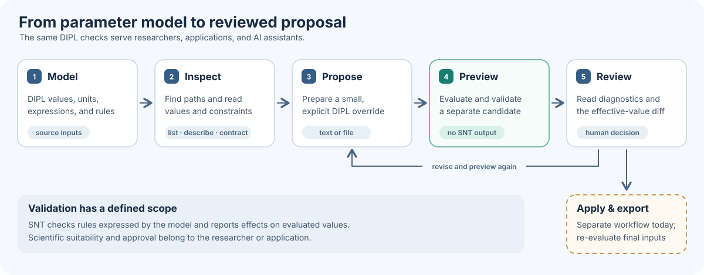

Inspect, propose, preview, review
=================================

DIPL can serve as a checked parameter model for a person, script, or AI
assistant. The model declares values, types, units, expressions, and any
enforced options or conditions. A client can inspect the evaluated model,
propose an override, and ask SNT to evaluate that proposal before changing
project inputs. The same rules apply regardless of who proposes the change.

Imagine a simulation whose input says an object travels 24 metres in 8
seconds. Its speed is calculated from those numbers. You want to ask, "What
would happen if the distance were 30 metres?" A person or AI assistant can
suggest that change as an *override*—a replacement value to try. SNT checks
the proposed value against the model's rules and shows that the calculated
speed would change from 3 to 3.75 metres per second. If the suggestion uses
the wrong units or breaks a rule, the preview reports the problem. The
original input file stays as it was while you decide whether to keep the
change.

This is deliberately a trivial calculation: you could work out the new speed
yourself. The workflow pays off with larger parameter models, where one edit
may affect several calculated values, activate different settings, or violate
a unit or value constraint that is easy to overlook. Preview shows the
resulting configuration and the checks DIPL can actually perform, so the
reviewer can focus on the scientific choice rather than tracing every
relationship by hand.

   Solid stages are available now. The final dashed stage is a separate
   project workflow; preview does not retain a candidate for later export.

The example below uses
``examples/dip/SemanticDescription/parameters.dip`` from the repository root.
Replace that path with your own ``DIPfile`` or DIPL file. CLI commands return
JSON for use by both applications and agents; :doc:`Python <integrations/python>`
and :doc:`C++ <modules/dip/inspection>` expose the same underlying inspection
and preview operations.

1. Inspect the evaluated model
------------------------------

Start by finding paths and reading one parameter's effective value, units,
description, rules, and provenance. ``list`` limits the number of results;
``describe`` gives more detail for one path.

.. code-block:: console

   snt dip list --input examples/dip/SemanticDescription/parameters.dip \
       --query '?simulation.' --limit 20 --format json
   snt dip describe --input examples/dip/SemanticDescription/parameters.dip \
       --path simulation.distance --format json

For dependencies, add ``--record-graph`` while reading a DIPfile or DIPL
input. A DIPH5 snapshot can be inspected using its saved graph, if it has one.
The :doc:`inspection guide <modules/dip/inspection>` covers values, source
locations, tables, arrays, and graph queries in more detail.

2. Check the proposed target
----------------------------

Before writing an override, ask what the path can represent:

.. code-block:: console

   snt dip override-contract \
       --input examples/dip/SemanticDescription/parameters.dip \
       --path simulation.distance --format json

Here the result is an ``existing_value`` of type ``float64`` with units of
metres. The contract can also identify an existing collection item, a new
schema-backed item, or an unavailable target with a reason. For example,
``items[]`` may append a schema-backed list item and ``materials[copper]``
may create a schema-backed map item. The contract describes the *current*
model; it does not validate the value an override will supply.

3. Propose and preview an override
----------------------------------

An override supplies DIPL text. It can come from a file or directly from the
command line. Preview evaluates the original inputs and a separate candidate
with the override, then returns diagnostics and an effective-value diff.

.. code-block:: console

   snt dip preview \
       --input examples/dip/SemanticDescription/parameters.dip \
       --override 'simulation.distance = 30 m' --format json

In this example, ``baseline_valid`` and ``candidate_valid`` are true. The
diff reports two changed values: ``simulation.distance`` goes from 24 m to
30 m, and the derived ``simulation.speed`` goes from 3 m/s to 3.75 m/s.
That second change is why inspecting only the edited line is insufficient.
To try several edits, repeat ``--override`` or use ``--override-file``.

If a candidate violates an enforced condition, uses incompatible units, or
targets an unknown path, inspect ``candidate_diagnostics`` and revise the
proposal. An invalid candidate still produces a JSON preview result.
Preview does not edit the DIPfile or write generated outputs.

4. Review and apply
-------------------

Review the candidate's validity, accepted override targets, diagnostics,
and all relevant changed values. A DIPL-valid candidate satisfies the rules
expressed by that model; a researcher or calling application still decides
whether it is scientifically appropriate. The review can lead back to a new
proposal and another preview.

After approval, keep the accepted override in the project's normal input
workflow. For a DIPfile project, an override file contains the same unwrapped
body used by ``--override-file``. For example, ``candidate.dip`` can contain:

.. code-block:: dipl

   simulation.distance = 30 m

After review, register it once in the DIPfile:

.. code-block:: dipl

   overrides[]
     file = "candidate.dip"

Alternatively, edit the DIPL source itself or use its ``$override`` block.
See :doc:`DIPfile projects <modules/dip/projects>` for the project layout.
Evaluate the resulting inputs again for a report, :doc:`static generation
<modules/dip/generation>`, or a :doc:`project-specific adapter
<modules/dip/adapters>`. At present, preview discards its candidate after
returning the result. SNT does not yet provide an approval action that retains
and exports that exact validated candidate or checks whether source files
changed between preview and export. Re-evaluate the final inputs before using
generated files.

This workflow is useful without an AI assistant: an editor, CI job, or script
can use the same inspection and preview commands. SNT performs deterministic
evaluation and validation; the client decides what to propose and what to do
with the result.
