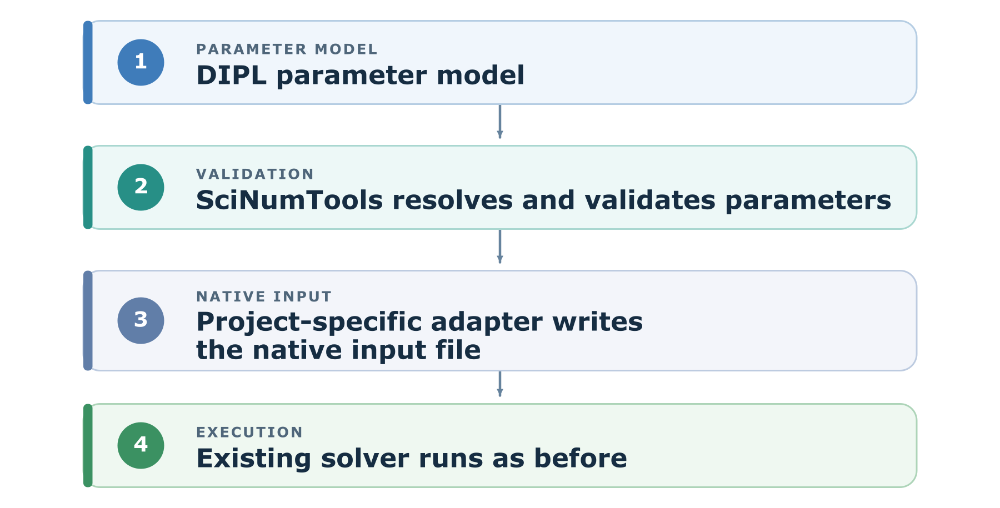
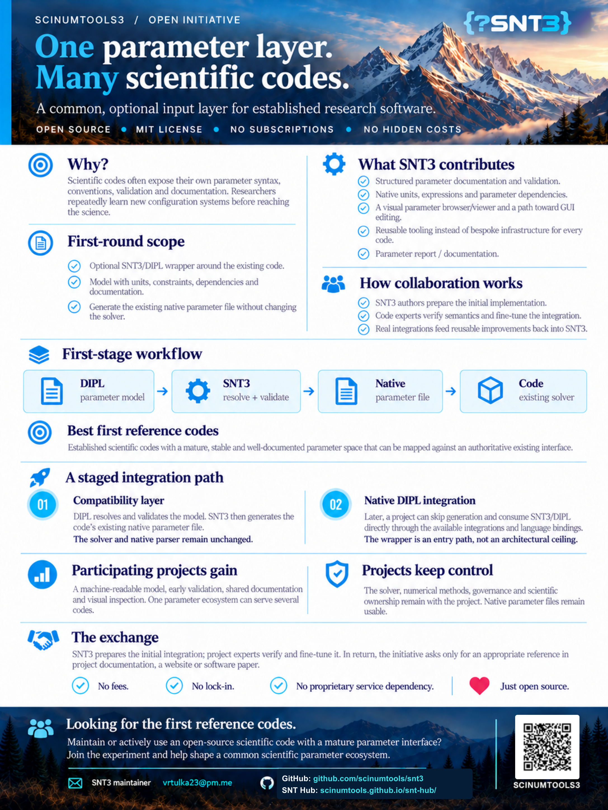

Shared inputs for scientific codes
==================================

Established scientific codes have earned trust through years of numerical
work. Their input interfaces often grew independently, though: every code
has its own syntax, unit conventions, validation rules, and documentation.
Researchers moving between codes repeatedly have to learn those details and
reconstruct the meaning of each parameter.

This open initiative invites maintainers and users of mature, open-source
research codes to explore a common, **optional input layer** based on DIPL
and SciNumTools. The aim is to make parameter definitions easier to inspect,
validate, document, and reuse across projects while respecting each code's
existing workflow.

A practical first integration
-----------------------------

The first integration is a compatibility layer around an existing program:

The code's numerical methods, solver, and native input format remain under
the project's control. Existing native files can still be used. Direct DIPL
integration is the longer-term aim where the parameter model and tooling have
earned enough stability and trust. The external adapter is a practical first
step. An independent proof of concept can test whether DIPL faithfully
represents an established code's interface without implying upstream
participation or endorsement.

AI-assisted setup with explicit checks
--------------------------------------

A DIPL definition is plain text with explicit types, units, constraints, and
relationships. Researchers and AI assistants, including those based on large
language models, can inspect and edit the same setup description. This could
help automate the preparation of run settings and parameters that describe or
refer to initial-condition inputs. A project-specific adapter can check
additional requirements of the target code, including relationships between
settings and referenced input files, before generating its native parameter
file.

These tools can propose setups, but plausible text alone is not evidence that
a simulation is configured correctly. Explicit validation
can catch missing or inconsistent inputs before a run; scientific judgment is
still needed to assess whether the chosen setup is physically appropriate.

What a shared parameter model can offer
---------------------------------------

A DIPL model can keep effective values, units, types, constraints,
dependencies, descriptions, and source information together. SciNumTools can
validate and evaluate that model before it reaches the solver, and generate
parameter reports that make a run easier to review. A visual parameter
browser, with a path toward GUI editing, is part of the broader initiative.

The intent is reusable tooling around each code's scientific interface,
without asking code maintainers to give up ownership of their numerics or
project governance.

How to participate
------------------

The best first collaborators are established open-source codes with mature,
stable, documented parameter spaces. The SciNumTools authors can prepare an
initial adapter and parameter model; experts in the participating code would
check that the definitions and generated native files preserve the code's
intended semantics. Improvements to shared tooling can then feed back into
SciNumTools for other projects to use.

SciNumTools is open source under the MIT license. The initiative has no
subscription or hidden cost. Participating projects retain their own
governance and would be asked to provide an appropriate reference to the
collaboration in their documentation, website, or a paper.

If you maintain or use a suitable scientific code, start a discussion in the
project's issue tracker.

The initiative flyer
--------------------

   The full initiative flyer, shown at a smaller size. Select the image to open it at full resolution.

A badge for participating projects
----------------------------------

Projects can place a compact badge alongside their Build, Documentation, and
License badges. It links readers to this initiative; describe the project's
actual SNTv3 integration in the surrounding README text.

.. image:: https://img.shields.io/badge/DIPL-%7B%3FSNTv3%7D-2980b9
   :alt: DIPL — {?SNTv3}
   :target: https://scinumtools.github.io/snt3/initiative.html

Copy this Markdown into your project's ``README.md``:

.. code-block:: markdown

   
             
