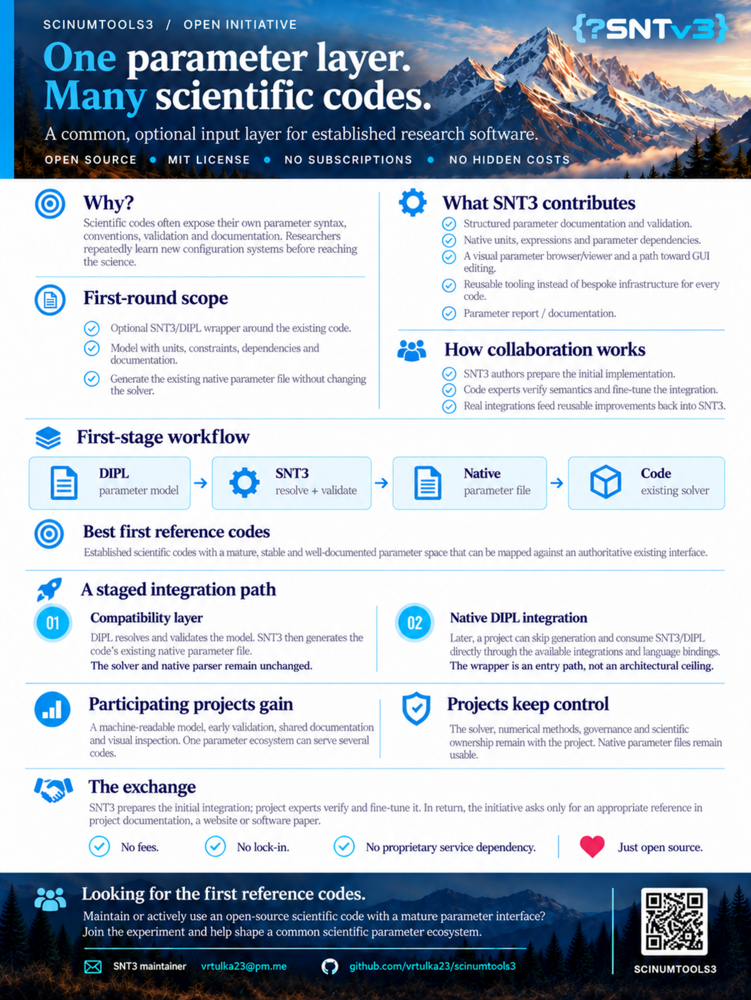

Shared inputs for scientific codes
==================================

Established scientific codes have earned trust through years of numerical
work. Their input interfaces often grew independently, though: every code
has its own syntax, unit conventions, validation rules, and documentation.
Researchers moving between codes repeatedly have to learn those details and
reconstruct the meaning of each parameter.

This open initiative invites maintainers and users of mature, open-source
research codes to explore a common, **optional input layer** based on DIPL
and SciNumTools. The aim is to make parameter definitions easier to inspect,
validate, document, and reuse across projects while respecting each code's
existing workflow.

A practical first integration
-----------------------------

The first integration is a compatibility layer around an existing program:

.. code-block:: text

   DIPL parameter model
          |
          v
   SciNumTools resolves and validates parameters
          |
          v
   Project-specific adapter writes the native input file
          |
          v
   Existing solver runs as before

The code's numerical methods, solver, and native input format remain under
the project's control. Existing native files can still be used. Direct DIPL
integration can be considered later if a project wants it; the wrapper is a
starting point rather than a limit on future integration.

What a shared parameter model can offer
---------------------------------------

A DIPL model can keep effective values, units, types, constraints,
dependencies, descriptions, and source information together. SciNumTools can
validate and evaluate that model before it reaches the solver, and generate
parameter reports that make a run easier to review. A visual parameter
browser, with a path toward GUI editing, is part of the broader initiative.

The intent is reusable tooling around each code's scientific interface,
without asking code maintainers to give up ownership of their numerics or
project governance.

How to participate
------------------

The best first collaborators are established open-source codes with mature,
stable, documented parameter spaces. The SciNumTools authors can prepare an
initial adapter and parameter model; experts in the participating code would
check that the definitions and generated native files preserve the code's
intended semantics. Improvements to shared tooling can then feed back into
SciNumTools for other projects to use.

SciNumTools is open source under the MIT license. The initiative has no
subscription or hidden cost. Participating projects retain their own
governance and would be asked to provide an appropriate reference to the
collaboration in their documentation, website, or a paper.

If you maintain or use a suitable scientific code, contact
`vrtulka23@pm.me <mailto:vrtulka23@pm.me>`_ or visit the
`SciNumTools3 repository <https://github.com/vrtulka23/scinumtools3>`_.

The initiative flyer
--------------------

   The full initiative flyer, shown at a smaller size. Select the image to open it at full resolution.
