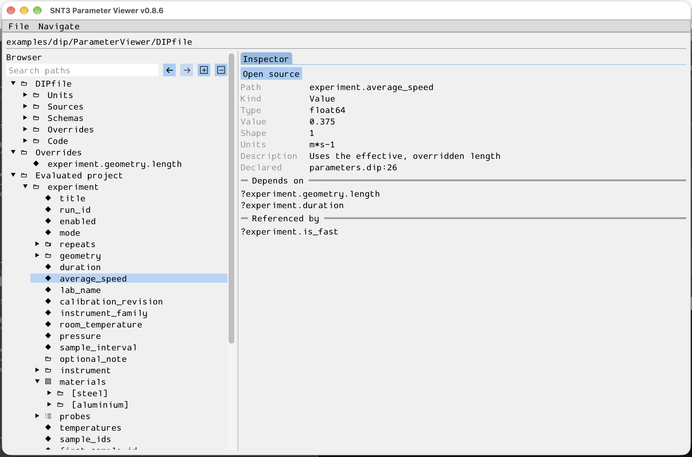

Parameter Viewer
================

``snt view`` is an optional, read-only graphical browser for DIPL parameters.
It uses the evaluated DIP environment to show values, provenance, and recorded
dependencies. The viewer is part of the main ``snt`` executable; it does not
need a separate application binary.

   The Parameter Viewer inspecting a live DIPfile project. Select the image
   to open it at full size.

Build and open
--------------

Enable the viewer and initialize its Dear ImGui and GLFW submodules before
building:

.. code-block:: sh

   git submodule update --init external/imgui external/glfw
   cmake -S . -B build -DENABLE_SNT_VIEW=ON
   cmake --build build --target snt
   build/bin/snt view examples/dip/ParameterViewer/DIPfile

The command accepts a live ``DIPfile``, a ``.dip`` or ``.dipl`` source, or an
evaluated ``.diph5`` snapshot. Viewer support requires
``ENABLE_EXEC_APPS_SNT=ON``. With ``ENABLE_SNT_VIEW=OFF``, Dear ImGui, GLFW,
and OpenGL are not compiled or linked into ``snt``. See :doc:`../dependencies`
for the general source-build requirements.

On Debian or Ubuntu, these packages provide the native files for the OpenGL,
X11, and Wayland backends:

.. code-block:: sh

   sudo apt-get install libgl-dev libglvnd-dev libx11-dev libxext-dev libxrandr-dev \
     libxinerama-dev libxcursor-dev libxi-dev libwayland-dev libwayland-bin \
     libxkbcommon-dev wayland-protocols pkg-config

If the X11 development library is unavailable, the build skips X11. GLFW
needs ``wayland-scanner`` from ``libwayland-bin`` when its Wayland backend is
enabled.

Browse a project
----------------

The browser separates overrides, the evaluated project, schemas, named
sources, and custom units. A live ``DIPfile`` also has a top branch, above
Overrides, grouping its registered inputs by type with their order preserved
within each group. Use
**Search paths** to filter the tree,
or the adjacent controls to expand and collapse its branches. Select a
parameter to inspect its value, units, metadata, source locations, and
dependencies. Follow a dependency to its input, then use the back and forward
buttons to return to earlier selections. Values from named sources can be
opened under the **Sources** branch through ``source?path`` references.

The top path bar shows the argument supplied to ``snt view``. Source file
locations in the inspector are displayed relative to the opened artifact's
directory. The :ref:`ParameterViewer example <dip-parameter-viewer-example>`
provides a project with groups, collections, overrides, schemas, sources,
units, expressions, arrays, and a table for exploring these views.

Open source and reload
----------------------

For live ``.dip``, ``.dipl``, and ``DIPfile`` inputs, **Open source** opens the
selected declaration in a read-only tab with DIPL syntax highlighting. An
overridden parameter offers its effective override and original declaration.
Custom units and schemas link to their definitions. The source tab also has a
**Copy source** button. For code embedded as a string in a ``DIPfile``, the
action points to the string's registration line;
its internal line numbers do not refer to physical file lines.

Use **File → Reload** or **Ctrl+R** after editing an input file externally.
If the updated input fails to parse, the viewer keeps the last valid state
and displays the error.

Snapshot limits
---------------

A ``.diph5`` snapshot stores evaluated values and selected provenance, but
does not retain complete source text or the live DIPfile manifest. Source
opening and browsing named source nodes are therefore available only for live
inputs. Standalone ``.dipt`` opening and scalable access to large numerical
datasets are not yet available.

For the C++ inspection functions behind these views, see
:doc:`DIP inspection <../modules/dip/inspection>`.
