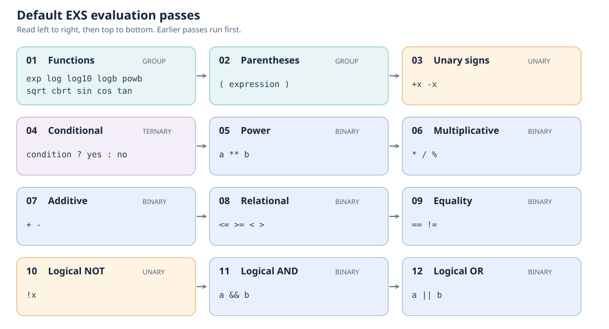

Operators and evaluation order
==============================

EXS separates **recognition order** from **evaluation order**.
``OperatorList`` registers operator implementations by type. Its append order
is the order in which the solver checks symbols while tokenizing an
expression. Register overlapping symbols in a suitable order, such as
``!=`` before ``!``. ``StepList`` specifies the passes that evaluate the
recognized operators: earlier steps run first and therefore determine
precedence. A step names an operation category and the operator types to run
in that pass.

Default operations
------------------

The default ``Solver<Atom>`` uses these twelve ``StepList`` passes. Each card
shows the operation type and its registered symbols or function names.
Operators in one pass share the same precedence; the numbers show pass order,
not the order in which symbols are recognized during tokenization.

The defaults are defined by ``Solver::init_steps()`` in
``include/snt/exs/solver.h``. The same operator can appear in different passes:
``+`` and ``-`` run once as unary signs and later as binary addition and
subtraction.

For example, the :doc:`ModifiedSolver example <../../examples/exs>` uses
``N``, ``A``, and ``O`` as logical symbols and supplies its own step order:

.. code-block:: cpp

   #include <memory>
   #include <snt/exs/solver.h>

   snt::exs::OperatorList operators;
   operators.append(snt::exs::NOT_OPERATOR,
                    std::make_shared<snt::exs::OperatorNot>("N"));
   operators.append(snt::exs::AND_OPERATOR,
                    std::make_shared<snt::exs::OperatorAnd>("A"));
   operators.append(snt::exs::OR_OPERATOR,
                    std::make_shared<snt::exs::OperatorOr>("O"));

   snt::exs::StepList steps;
   steps.append(snt::exs::BINARY_OPERATION, {snt::exs::OR_OPERATOR});
   steps.append(snt::exs::BINARY_OPERATION, {snt::exs::AND_OPERATOR});
   steps.append(snt::exs::UNARY_OPERATION, {snt::exs::NOT_OPERATOR});

   snt::exs::Solver<snt::exs::Atom> solver(operators, steps);
   auto result = solver.eval("N false A false O true");

Here ``O`` is evaluated before ``A``, and ``N`` after both. Operators can be
used only if they are registered **and** included in an appropriate step.
Passing only an ``OperatorList`` to the solver keeps the default steps;
passing only a ``StepList`` keeps the default operators. Passing both replaces
both defaults, so register and schedule every operator needed by the
expression. Use ``UNARY_OPERATION``, ``BINARY_OPERATION``,
``TERNARY_OPERATION``, or ``GROUP_OPERATION`` according to the operator's
implementation.

See :doc:`Custom atoms and operations <custom-operations>` for adding a new
operator type rather than changing the symbols of existing ones.
