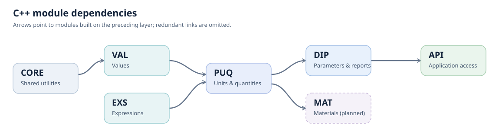

SNT Architecture
================

SciNumTools v3 is a layered C++ framework. :doc:`CORE <core/index>` supplies
shared infrastructure, :doc:`VAL <val/index>` represents scalar and array
values, and :doc:`EXS <exs/index>` evaluates expressions.
:doc:`PUQ <puq/index>` adds physical quantities and units. :doc:`DIP <dip/index>`
combines these capabilities to define and evaluate scientific input
parameters, while :doc:`API <api/index>` exposes them to applications and
services. :doc:`MAT <mat/index>` is planned as a future module for materials
and chemical composition.

The module structure appears in the C++ namespaces and, where exposed, the
Python modules. Each linked module page provides details and usage guides.

